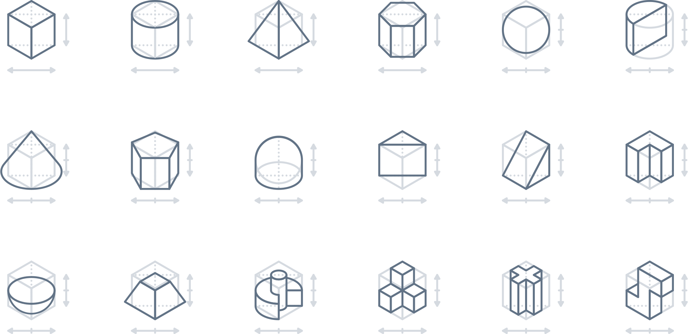

# Nutanix Design System

1. **Unified**

   Each piece is part of a greater whole and should contribute positively to the system at scale. There should be no isolated features or outliers.

2. **Universal**

   Airbnb is used around the world by a wide global community. Our products and visual language should be welcoming and accessible.

3. **Iconic**

   We’re focused when it comes to both design and functionality. Our work should speak boldly and clearly to this focus.

4. **Conversational**

   Our use of motion breathes life into our products, and allows us to communicate with users in easily understood ways.

