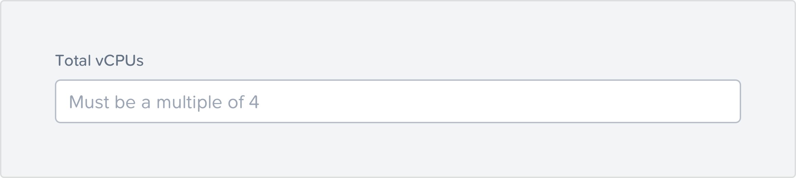

# Components

### **Buttons**

An ideal button labeling has a {verb} + {noun} structure. A verb indicates the button is actionable while giving the idea about what to expect.

Avoid generic labels like “OK”, “Cancel”, “Done” for buttons.

**Do:** Add Funds, View Usage  
**Don’t:** Add, View

Create vs Add: Use “Add” when user is adding to an existing data set and “Create” when something is being created from scratch.

###  **Links**

Links can be used to redirect the user to a resource, section, etc. Link the resource, and not the entire sentence. Avoid using “click here” as link text.

**Do:** You can choose to disable auto renewal.  
**Don’t:** Click here to disable auto renewal.

Add context to where the link will redirect.

**Do:** Know more about our price calculator.  
**Don’t:** Know more.

### **Error Messages**

Error messages are one of the most critical parts of designing an experience. As a general thumb rule frame an error message as {problem} + {cause of error} + {solution}.

Do: Provide appropriate actions that can be routes to solve the problem.  
Be humble. Speak it aloud like you are explaining someone.  
Disclose information progressively.

Don’t: Use technical jargon.  
Use exclamation marks.  
Imply that the error is users fault.  
Use negative words like “Access denied”.

### **Confirmation Messages**

Even though confirmation messages can act as friction when a user is trying to perform an action, they are very efficient in improving the user experience. Confirmation messages are used to “confirm” with the users if they want to proceed with an action or cancel.

Do: Present the action in the header.  
Explain the outcome in the body.  
Reinstate the action with the button.

Don’t: Be repetitive.  
Ask vague questions like “Are you sure?”  
Be vague about action buttons.

#### 

### **Forms**

If done right, form feels like a conversation and reduces the time required to complete it. Here are the components of a good form.

### \*\*\*\*

### **Headings and Field Labels**

Group headings and field labels logically to allow easier visual scanning.  
**Do:** Use title style capitalizations.  
**Don’t:** Don’t use headings that are unnecessarily long.

\*\*\*\*

### **Placeholder Text**

This is the light text that appears within a field label and disappears when data is entered in the field.

Don’t: Don’t place text which user will need to memorize for cross-verifying after he/she has entered the data as a placeholder text.

Do: Place text that user might need after filling the field as notes.

**Don’t:** Avoid repeating the field labels and excessive usage of please as placeholder text.

  
**Do:** Use action-oriented placeholder text in sentence style capitalization.

### \*\*\*\*

### **Notes**

This is the related subtext below the field labels. Use them to provide notes or instructions to fill the field label.

**Do**: If the instruction is too long or consists of the definition of the field label, try disclosing it progressively.

Try wording the link as a question a user would ask himself/herself while filling it.

### \*\*\*\*

### **Tables**

Always right-align a block or column of whole numbers or of whole numbers and text. Align numbers at the decimal point \(or imaginary decimal point if there are only whole numbers\).

