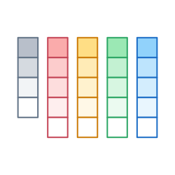
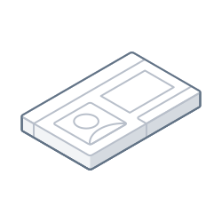

# Website Illustration Guidelines

### Color

  
Never use colors beyond this palette, or alter the opacity of colors / strokes. The first and second row are used for motion lines and floor guides.

<table>
  <thead>
    <tr>
      <th style="text-align:left"></th>
      <th style="text-align:left"></th>
    </tr>
  </thead>
  <tbody>
    <tr>
      <td style="text-align:left">
        
      </td>
      <td style="text-align:left">&#x200B;&#x200B;Highlight areas of interest within an illustration using
        a non-grey shade.</td>
    </tr>
    <tr>
      <td style="text-align:left">
        

        

          
        

      </td>
      <td style="text-align:left">Only use one set of shades for a color per object.</td>
    </tr>
  </tbody>
</table>### 

### 

### Stroke

​​When using color, be wary of any connotations that certain shades may have; the majority of illustrations will have a grey base. The majority of illustrations can be created using a stroke width of 2 pixels.

|  |  |
| :--- | :--- |
|  | ​​Use lighter strokes to add detail within objects where appropriate. |
|  | Use standard dashed strokes settings to show motion trails and lines connecting objects. |
|  | For strokes on the floor plane, use lighter shades; with dashed lines being a shade darker than solid lines \(see ‘Color’, \(2\) \). |
|  | Avoid harsh edges for connecting vertices or for separating surfaces of softer objects. |
|  | Use lighter shades when connecting objects or alluding to a form of assembly / structure. |

* 

