# Website Illustration Guidelines

### Overview

This illustration system was first conceptualized as a means to enrich the user experience and inject character in to the Prism platform. Though it has since grown beyond its initial purpose, the same ethos that was at the core of our initial developments- to form a flexible, intertwined system for creating illustrations with an emphasis on abstraction that encourages creative use of detail- continues to run throughout our work.

The guidelines below aim to adhere to this initial goal, while offering a platform that supports flexibility and scalability.

### Color

The color palette is a continuation of that used in the Nutanix design system's [Color](../../primitives/colors/) page. We felt that it was important to provide the opportunity to explore a spectrum of colors diverse enough to apply to a myriad of circumstances, while staying true to the tones most commonly seen within the user interface. With this in mind, the fills were chosen to complement- rather than distract- the accompanying design language.

<table>
  <thead>
    <tr>
      <th style="text-align:left">Color guidelines</th>
      <th style="text-align:left"></th>
    </tr>
  </thead>
  <tbody>
    <tr>
      <td style="text-align:left">
        

        

        
Never use colors beyond this palette, or alter the opacity of fills /
          strokes. The second and third row are used for motion lines and floor guides,
          with the top being the primary stroke color.

      </td>
      <td style="text-align:left">
        

        

          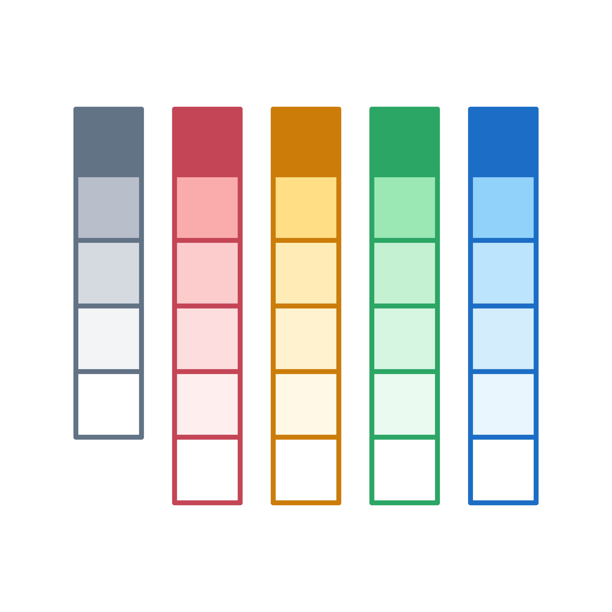
        

      </td>
    </tr>
    <tr>
      <td style="text-align:left">
        

        
Highlight areas of interest within an illustration using a non-grey shade.

      </td>
      <td style="text-align:left">
        

        

          
        

      </td>
    </tr>
    <tr>
      <td style="text-align:left">
        

        
Only use one set of shades for a color per object.

      </td>
      <td style="text-align:left">
        

        

          
        

      </td>
    </tr>
  </tbody>
</table> 

### **Construction**

The choice of orthographic \(isometric\) projection for illustrations came as a result of reflecting upon what we feel the Nutanix platform is, who our core audience are and how to best augment the existing design infrastructure.

Nutanix is a multitude of complex, interconnecting products and services; all finely tuned to work synchronously and seamlessly, despite their intricate and often distinct nature. With isometric projection, we are utilizing a more methodical approach to illustration that is often synonymous with technical drawing. We felt that this offered ample opportunity to visualize what are often abstract concepts, whilst reflecting our customer’s requirement for a professional, precise service.

<table>
  <thead>
    <tr>
      <th style="text-align:left">Construction guidelines</th>
      <th style="text-align:left"></th>
    </tr>
  </thead>
  <tbody>
    <tr>
      <td style="text-align:left">
        

        
Adhere to the idea of all objects being aligned to an isometric grid;
          all objects should be facing at an increment of thirty degrees.

      </td>
      <td style="text-align:left">
        

        

          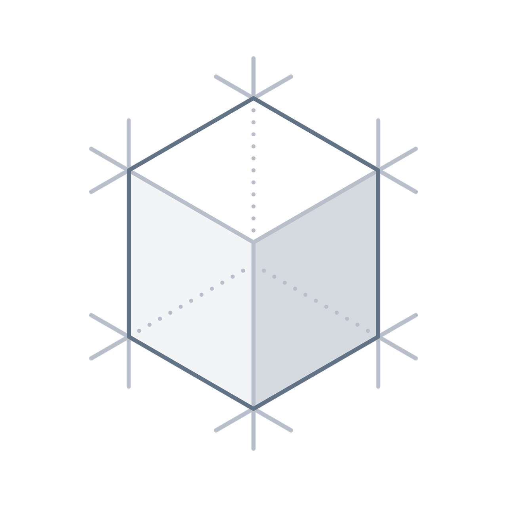
        

      </td>
    </tr>
    <tr>
      <td style="text-align:left">
        

        
Be sure to define the ground plane if creating an illustration with multiple
          objects.

        

      </td>
      <td style="text-align:left">
        

        

          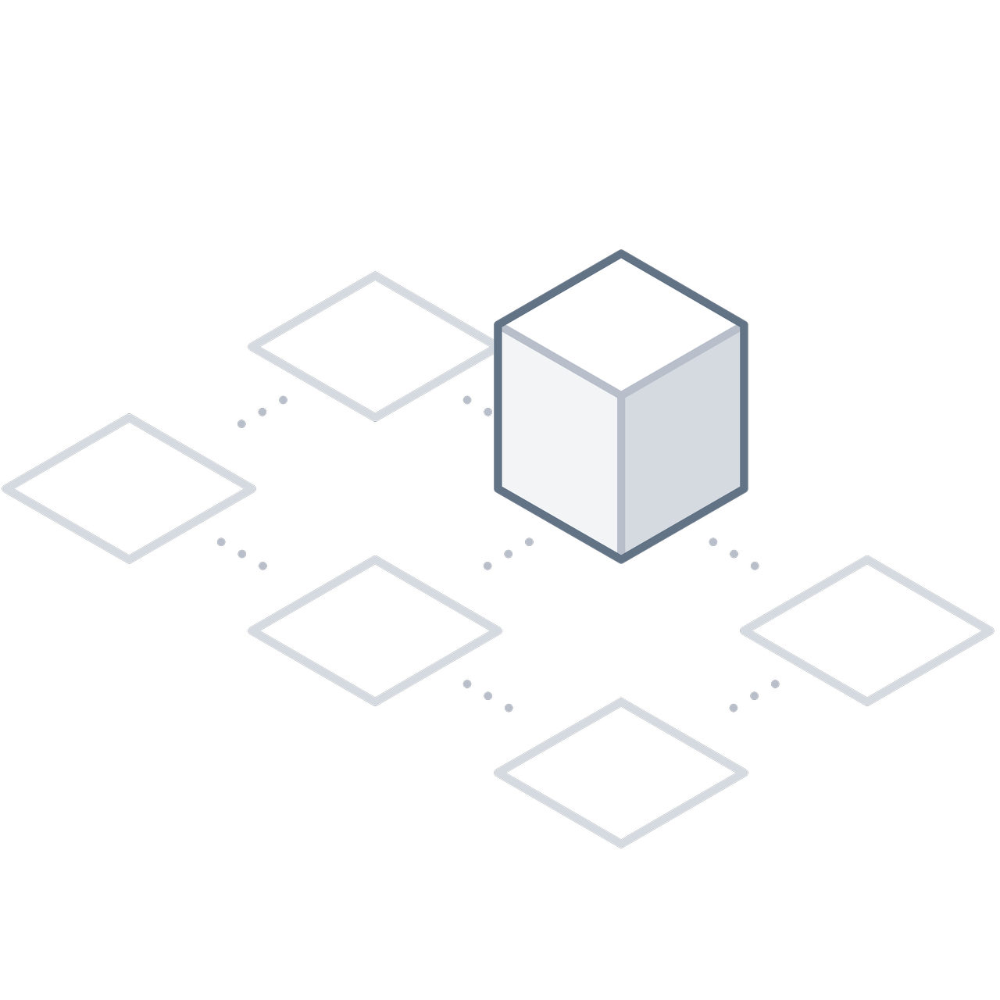
        

      </td>
    </tr>
    <tr>
      <td style="text-align:left">
        
If two objects of different colors are touching, the top and / or front
          object&#x2019;s stroke must be visible.

        

      </td>
      <td style="text-align:left">
        

        

          
        

      </td>
    </tr>
    <tr>
      <td style="text-align:left">
        
Use angles of 30 degree increments if showing the motion of two objects
          being connected.

        

      </td>
      <td style="text-align:left">
        

        

          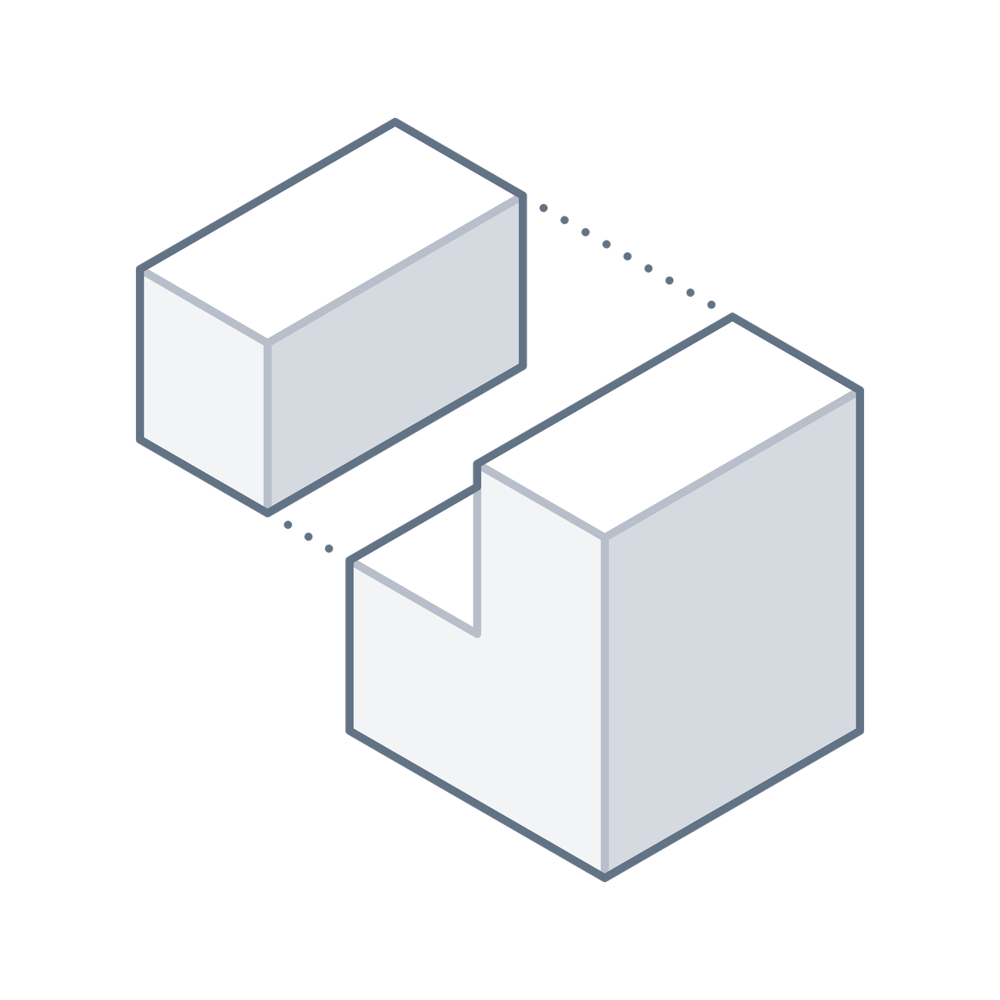
        

      </td>
    </tr>
    <tr>
      <td style="text-align:left">Align any connecting lines or associated objects to the center edge of
        the object.</td>
      <td style="text-align:left">
        

        

          
        

      </td>
    </tr>
    <tr>
      <td style="text-align:left">Leave a minimum spacing of four pixels between objects or lines on the
        same plane.</td>
      <td style="text-align:left">
        

        

          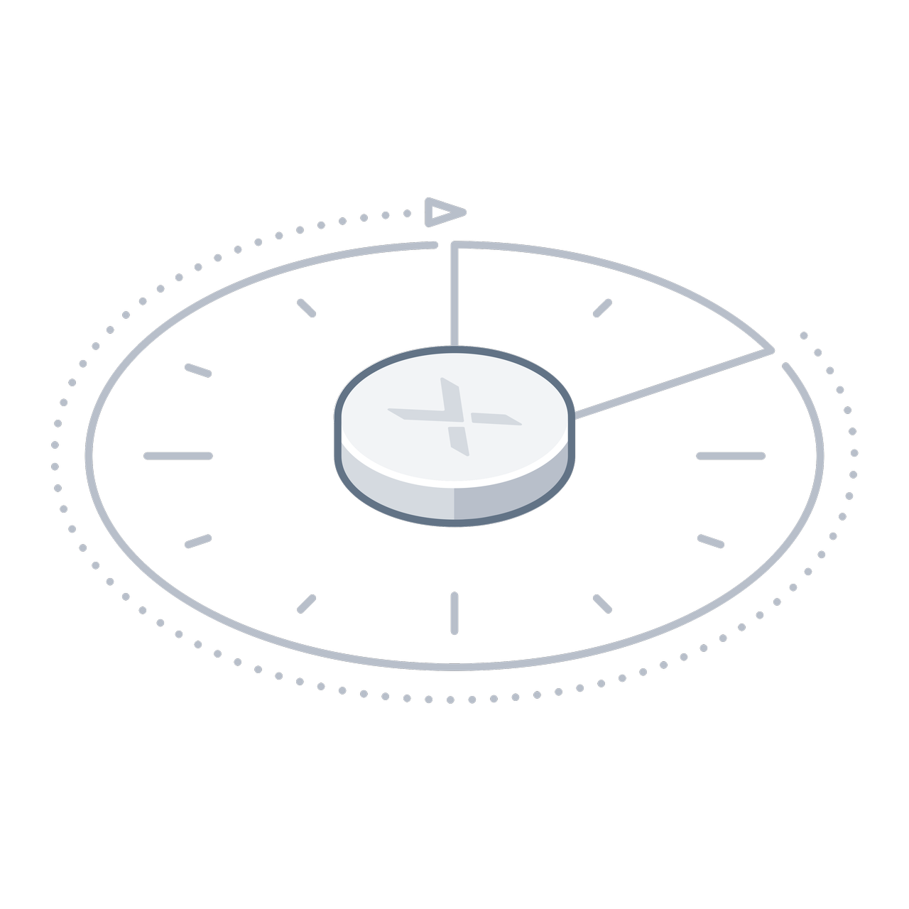
        

      </td>
    </tr>
    <tr>
      <td style="text-align:left">Exaggerate proportions of objects in smaller illustrations to improve
        visibility.</td>
      <td style="text-align:left">
        

        

          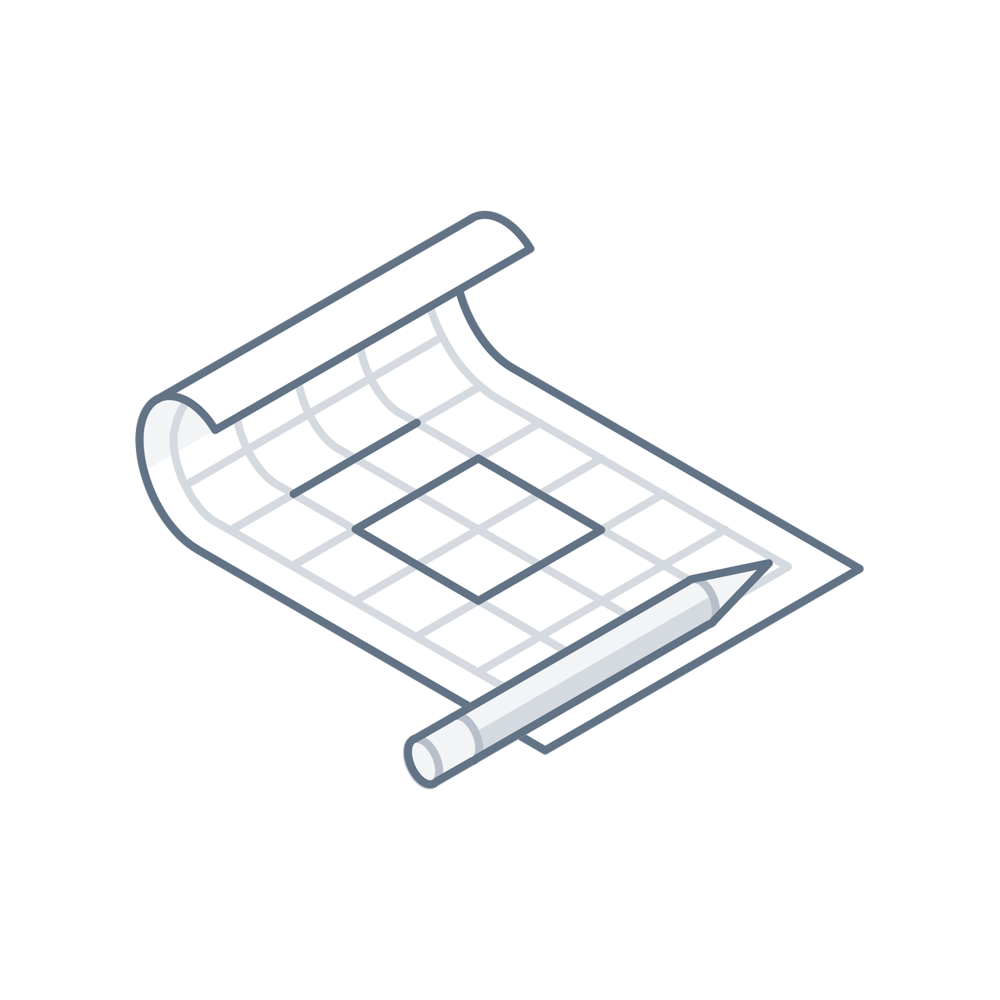
        

      </td>
    </tr>
    <tr>
      <td style="text-align:left">Simplify elements of objects that may create visual clutter even if untrue
        to actual form.</td>
      <td style="text-align:left">
        

        

          
        

      </td>
    </tr>
  </tbody>
</table>

### **Stroke**

The decision to use outlines \(strokes\) for our illustrations ultimately came down to visibility and in order to promote abstraction. By utilizing a 2 pixel stroke through the vast majority of use cases, it encourages the illustrator to shy away from creating unnecessary detail solely through pixel count and instead support creativity through conceptualizing what can often be incredibly abstract concepts.

<table>
  <thead>
    <tr>
      <th style="text-align:left">Stroke guidelines</th>
      <th style="text-align:left"></th>
    </tr>
  </thead>
  <tbody>
    <tr>
      <td style="text-align:left">
        
Use lighter strokes to add detail within objects where appropriate.

        

      </td>
      <td style="text-align:left">
        

        

          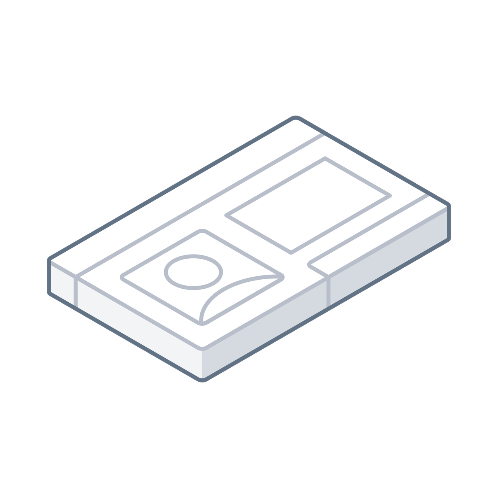
        

      </td>
    </tr>
    <tr>
      <td style="text-align:left">Use a dash of 0 pixels and spacing of 6 pixels when creating lines portraying
        motion or the flow of information.</td>
      <td style="text-align:left">
        

        

          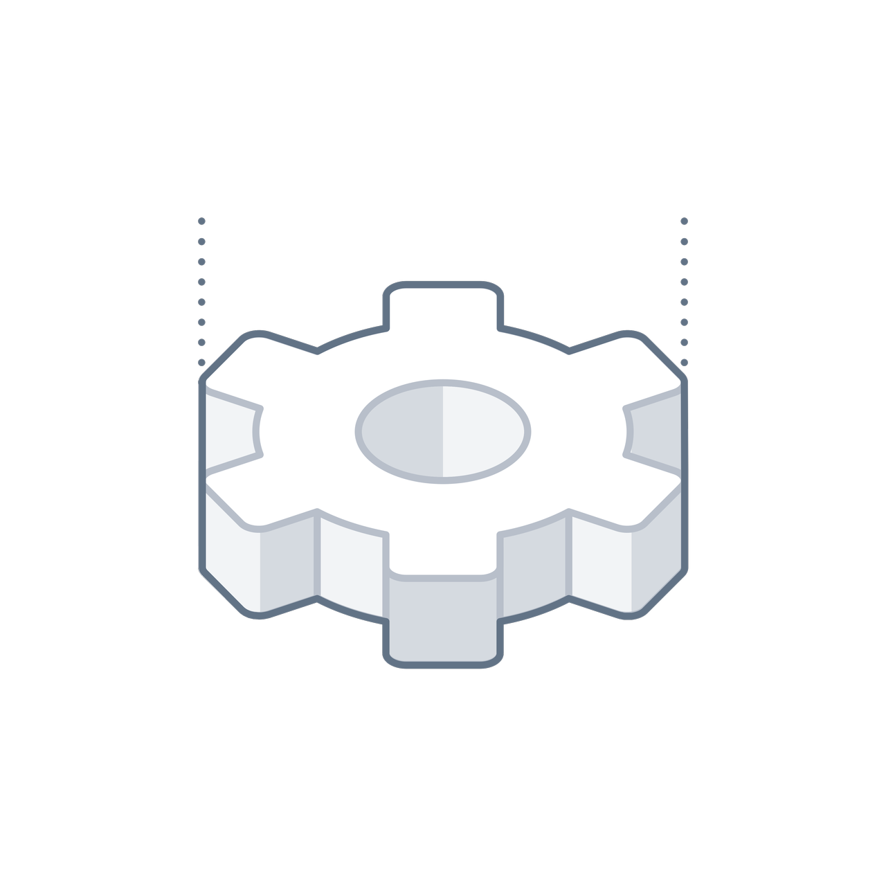
        

      </td>
    </tr>
    <tr>
      <td style="text-align:left">
        

        
For strokes on the floor plane, use lighter shades; with dashed lines
          being a shade darker than solid lines. These equate to the second and third
          rows of the palette.

      </td>
      <td style="text-align:left">
        

        

          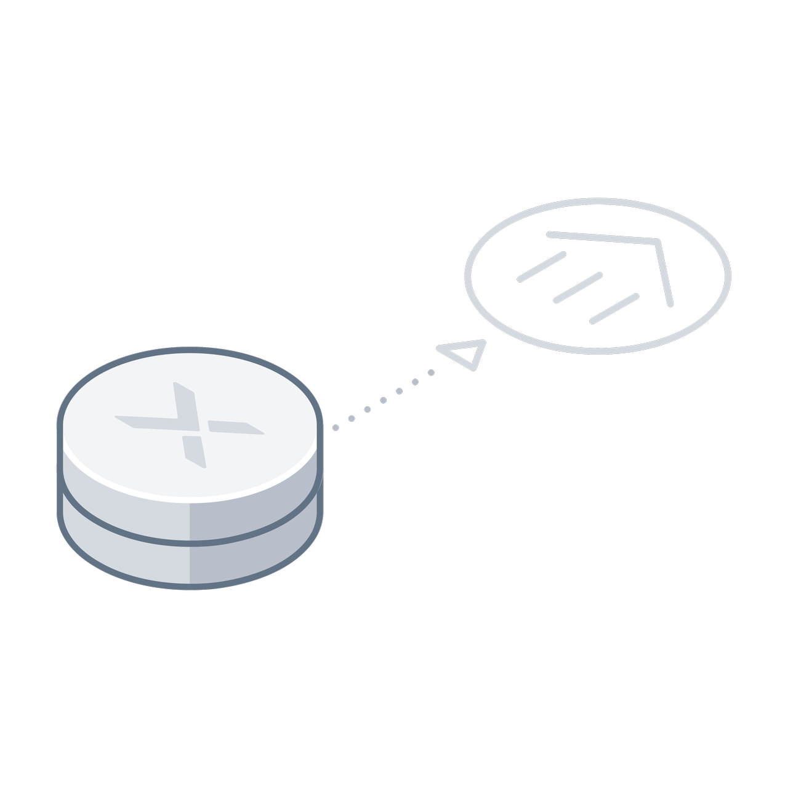
        

      </td>
    </tr>
    <tr>
      <td style="text-align:left">Avoid harsh edges for connecting vertices or for separating surfaces of
        softer objects.</td>
      <td style="text-align:left">
        

        

          
        

      </td>
    </tr>
    <tr>
      <td style="text-align:left">Use lighter shades when connecting objects or alluding to a form of assembly
        / structure.</td>
      <td style="text-align:left">
        

        

          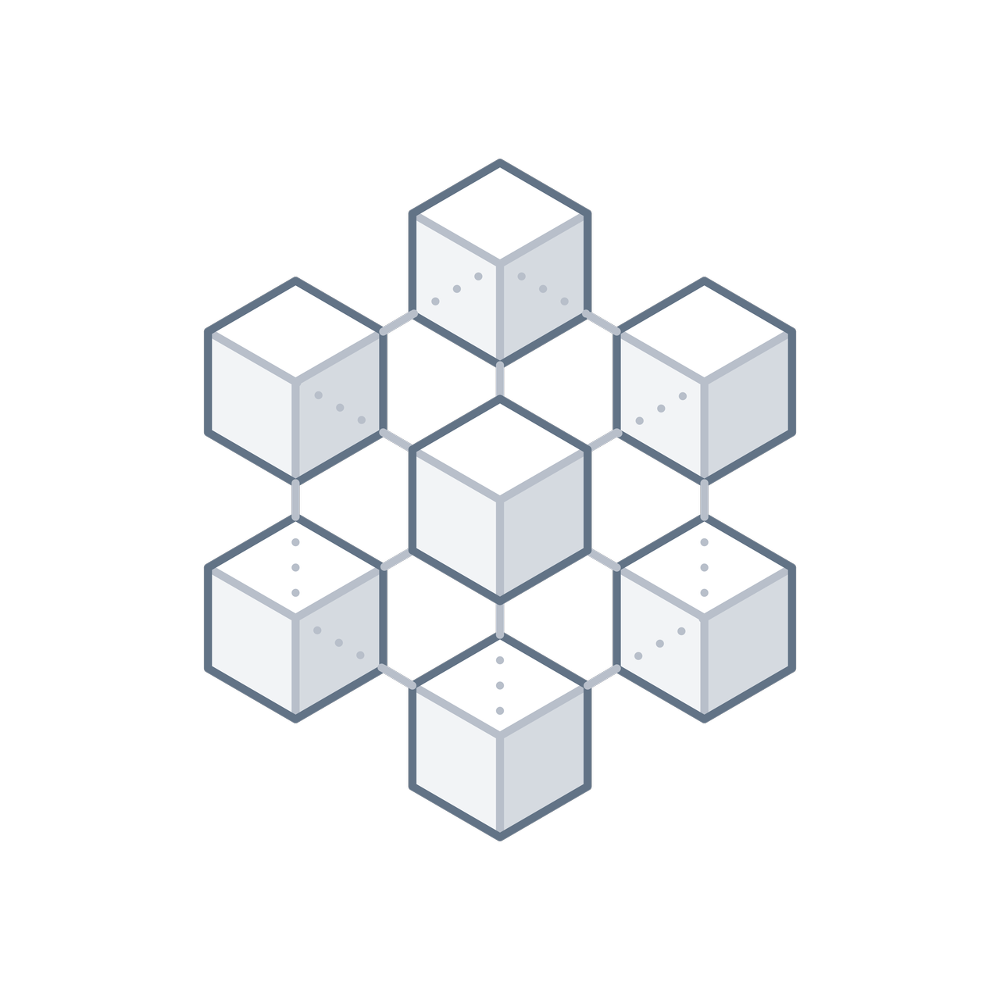
        

      </td>
    </tr>
  </tbody>
</table>

### Lighting

In keeping with our choice of palette and use of isometric construction, we felt that the lighting system should reflect our choice to abstract and simplify wherever possible. Although ‘physical’ objects are often portrayed, we are showing them in a relatively conceptual manner, with little detail and few properties that would make them akin to their true real-world form.

<table>
  <thead>
    <tr>
      <th style="text-align:left">Lighting guidelines</th>
      <th style="text-align:left"></th>
    </tr>
  </thead>
  <tbody>
    <tr>
      <td style="text-align:left">
        
Adhere to the concept of a uniform single light source hitting all objects
          at the angle shown.

        

      </td>
      <td style="text-align:left">
        

        

          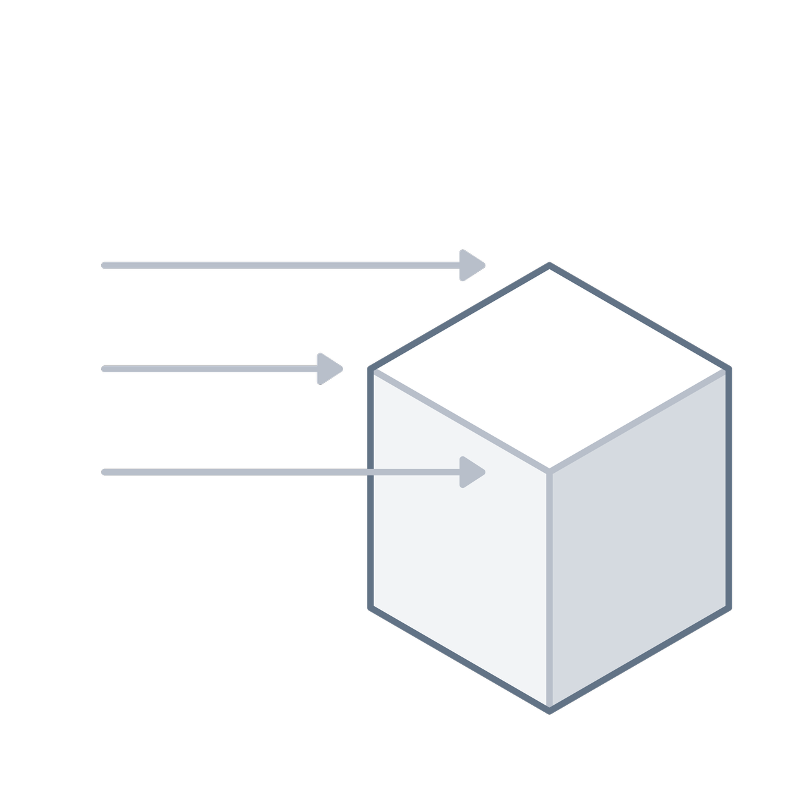
        

      </td>
    </tr>
    <tr>
      <td style="text-align:left">Use an alternate shade to show the lighting of a curved object. If this
        curvature is uniform, the shift in tone will occur at the center point
        of the object.</td>
      <td style="text-align:left">
        

        

          
        

      </td>
    </tr>
    <tr>
      <td style="text-align:left">
        
Only cast shadows within objects if needed; never on to the ground or
          on to other objects.

        

      </td>
      <td style="text-align:left">
        

        

          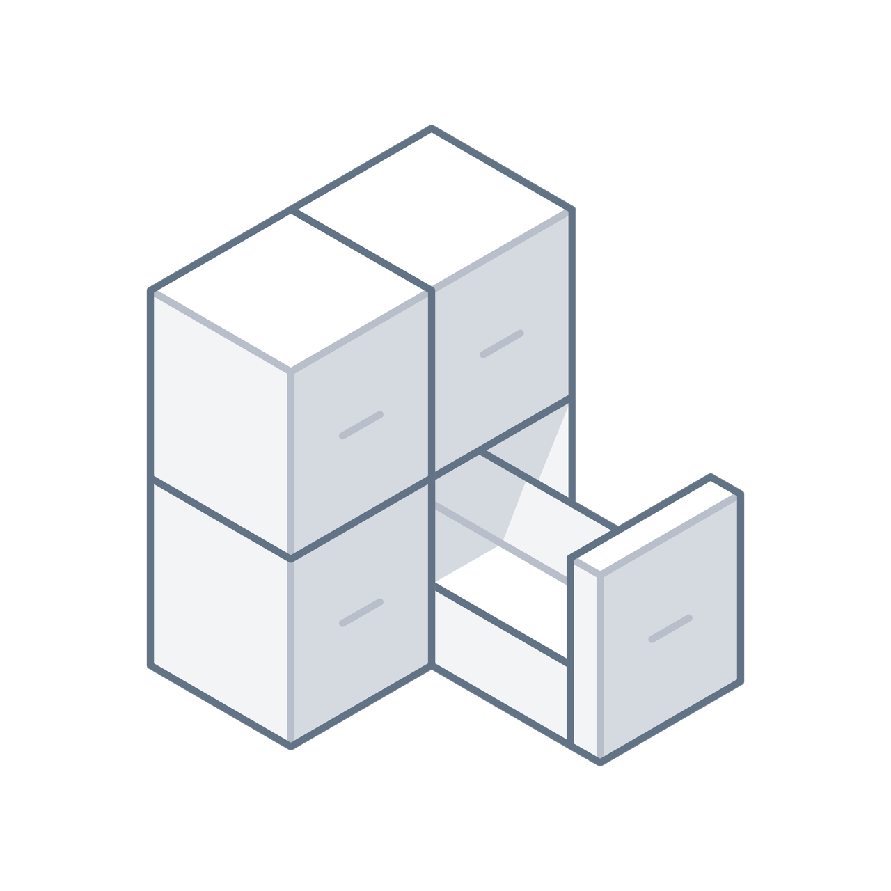
        

      </td>
    </tr>
    <tr>
      <td style="text-align:left">Choose lighter shades for strokes when showing edges of an object through
        a transparent surface.</td>
      <td style="text-align:left">
        

        

          
        

      </td>
    </tr>
  </tbody>
</table>

### Scaling

Uniformity and consistency can often be an issue when creating illustrations across a platform as vast and diverse as that of Nutanix. These illustrations can appear on screens ranging from the minute to the mammoth. Though the use of strokes encourages greater thought and care when problem solving, it can lead to some issues with consistency when scaling and positioning both entire illustrations and individual objects.

  
With this in mind, set sizing guidelines have been created to prevent any problems that may arise from resizing images after their creation. These sizes act as the cornerstone for setting up a scene and realizing what is plausible given the context.

| Width | Height | Type | Application |
| :--- | :--- | :--- | :--- |
| **900px** | **600px** | Extra Large | `Full Page no text` |
| **440px** | **300px** | Large | `On-boarding (1)` `Popup`  `Empty State` |
| **440px** | **200px** | Medium | `On-boarding (3)` `Popup` |
| **126px** | **126px** | Square | `Empty State` `Multistep On-boarding` |

\`\`

<table>
  <thead>
    <tr>
      <th style="text-align:left">Scaling guidelines</th>
      <th style="text-align:left"></th>
    </tr>
  </thead>
  <tbody>
    <tr>
      <td style="text-align:left">
        
Objects should use a two pixel stroke between the lower (20 pixel width)
          and upper (400 pixel width) extremities of a single object. When one object
          in the scene exceeds an extremity, the entire scene must be adjusted to
          the new stroke width.

        

      </td>
      <td style="text-align:left">
        

        

          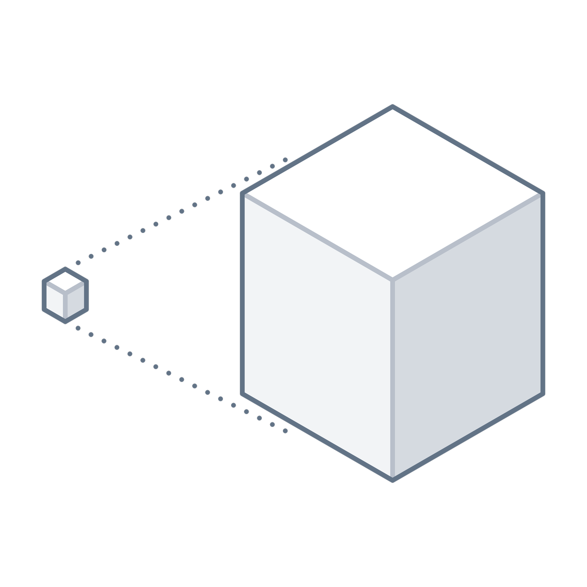
        

      </td>
    </tr>
    <tr>
      <td style="text-align:left">For complex scenes involving small objects, shading can be limited to
        reduce visual clutter.</td>
      <td style="text-align:left">
        

        

          
        

      </td>
    </tr>
  </tbody>
</table>

