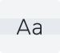
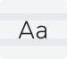
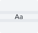

# Typography

#### Nutanix Soft 

Nutanix uses exclusively Nutanix Soft. A custom font that was created to fit our brand personality. Also improving on top of Proxima's Nova legibility in smaller sizes.

* Nutanix is the most used font in our design system.
* Used for all titles, copy, navigation, form elements and buttons.
* Should be styled as regular, medium and semibold only.
* For large titles we use thin style.
* Only use _italic_ is not supported in our system.
* 
| Font  | Name | Tag | Font Weight | Line Height | Font Size |
| :--- | :--- | :--- | :--- | :--- | :--- |
|  | Display Single | `<h1>` | Thin | 20 | 29px |
|  | Display Multi | `<h1>` | Thin | 35 | 29px |
|  | Paragraph | `
` | Regular | 21 | 14px |

