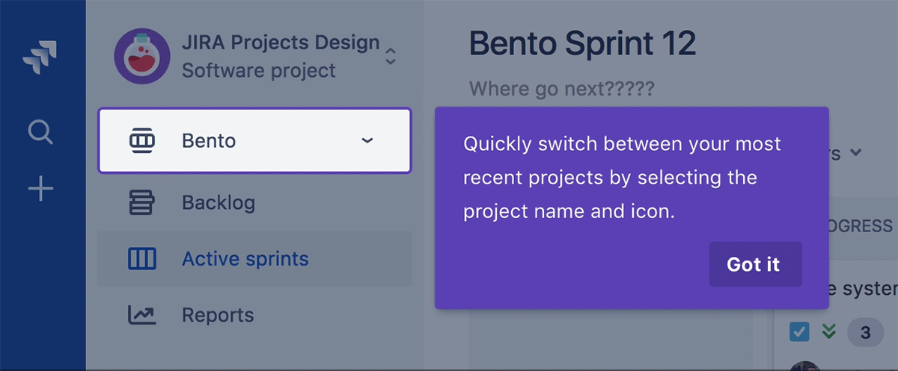

# Colors



 View in[ Abstract](https://share.goabstract.com/356c86b5-84b3-48b7-8291-b898d23252f2)


| Name | Hex | RGB | CMUK |
| :--- | :--- | :--- | :--- |
|  N900 - Slate | \#091e42 | 9,30,66 | 100,88,34,55 |


1. **Stepper:** Step through a series of dialogs to communicate multiple benefits of a single focus element or subsequent benefits for a related task. Avoid using this to show the actual steps of a task. 
2. **Secondary button:** Include a primary and secondary action. Best practice is to allow the user to skip or dismiss the spotlight. 
3. **Spotlight area action:** Include a call to action for the user to interact with functionality within the spotlight area.
4. **Illustration:** Include an illustration if it enhances the understanding for the user, and does not distract. Illustrations should be composed of metaphorical imagery that relates to the spotlight content or benefit. 
5. **Title:** Include a title to inspire or draw the user in to a message that may positively impact them, but may be ignored. 

### Best practices

* Keep in mind the entire flow when using spotlights. Try not to overwhelm with too much information.
* Always offer a dismiss option at each step. Don't force people to participate. Be kind. 
* Ideally spotlights will only have a single step, but at a maximum, aim to only have 3-4 steps. The viewer only needs enough information to get them started. We know the new feature is exciting, but try to contain yourself. 

#### Illustrations

* Are used to make complex ideas more accessible.
* Should be metaphorical and designed in conjunction with UI copy.
* Use to efficiently convey brand personality.
* Should not be used as decoration or without consideration.
* Are a tool to guide in the user in the right direction.

#### Writing tips

**Titles**

Do we really need a title? Is it just repeating a previous spotlight title or obvious functionality? Consider using: “**no title**”. Rule \#47, if you are struggling to name it, it probably doesn’t need a name.

* If you must, however, use the title to communicate the main benefit to the user.
  * **Manage your issues** instead of **Issue types**
  * **Easily add fields** instead of **Fields**
* Spotlight titles are a good place to add wink. 
* Try to personalize where you can. E.g. “Your room”. 
* Try to limit titles to 3 words, although 4 words are permissible if you are using a short article like “an”, “a”, or “the”.

**Message copy**

* Try to keep text length to 2 lines at the product's minimum supported size.
* If no title is present stick to benefits here. Don't just point out what the feature or functionality is. Tell why is it important to the person seeing it? 
* Be considerate of the viewers time and patience. Short bursts of information are better. 
* If you talk about an element or a location within the body of the spotlight message, that element should be visible on the screen at the same time. Don't talk about things that the viewer can't see. 

### Positioning

The position of the dialog is flexible and will be repositioned depending on how close the element is to the edge of the screen. 

### Pulse

The spotlight area should have a subtle pulse animation to draw attention to the focused area





```css
$black:             #000000;
$semi-black:        #1B2025;
$dark-grey-1:       #22272E;
$dark-grey-2:       #37414B;
$dark-grey-3:       #4D5969;
$grey-1:            #627386;
$grey-2:            #7C8D9F;
$grey-3:            #9AA5B5;
$light-grey-1:      #B8BFCA;
$light-grey-2:      #D5DAE0;
$light-grey-3:      #F2F4F6;
$semi-white:        #F8F9FA;
$white:             #FFFFFF;
```





**Blue**

Blue is used in two different scenarios, to inform or neutral state. The second usecase is to be used as a visual signifier of interactivity



```css
$blue-1:              #22A5F7;
$dark-blue-1:         adjust-hue(mix($blue-1, #000, 70%),12);
$dark-blue-2:         adjust-hue(mix($blue-1, #000, 80%),8);
$dark-blue-3:         adjust-hue(mix($blue-1, #000, 90%),4);
$blue-2:              mix($blue-1, #fff, 75%);
$blue-3:              mix($blue-1, #fff, 50%);
$light-blue-1:        mix($blue-1, #fff, 30%);
$light-blue-2:        mix($blue-1, #fff, 20%);
$light-blue-3:        mix($blue-1, #fff, 10%);
$semi-white-blue:     mix($blue-1, #fff, 5%);
```





**Red**

Red is exclusively used in critical notification or destructive actions.



```css
$red-1:               #F55656;
$dark-red-1:          adjust-hue(mix($red-1, #000, 70%),-12);
$dark-red-2:          adjust-hue(mix($red-1, #000, 80%),-8);
$dark-red-3:          adjust-hue(mix($red-1, #000, 90%),-4);
$red-2:               mix($red-1, #fff, 75%);
$red-3:               mix($red-1, #fff, 50%);
$light-red-1:         mix($red-1, #fff, 30%);
$light-red-2:         mix($red-1, #fff, 20%);
$light-red-3:         mix($red-1, #fff, 10%);
$semi-white-red:      mix($red-1, #fff, 5%);
```















$$
adjust-hue(coreColor + black (intensity/100), n-4)
$$

