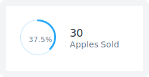

# Doughnut Chart

Suited for **general but not precise comparisons** with Categorical data. 

## Usage Guidelines

Use this model to show: **`Composition` `Distribution`**

When the data-set is: **`Single Attribute` `Categorical`**

Do not use this model for: **`More than 6 Categories`**

Color Palette: [Categorical](../../../primitives/colors/#categorical-qualitative-palette), [Diverging](../../../primitives/colors/#diverging-palette)

* Most effective if at least one segment accounts for 25 to 50 %
* Most significant category should start at the 12h mark
* Category should be colored in sequence using “[Categorical](../../../primitives/colors/#categorical-qualitative-palette)” color palette from 12h mark in the order of significance
  * Default Order: Descending order of value of the metrics 
  * For Health/Status Attribute: Worst to Best states \(and not the metric\)

## Chart Presets

### Tiny


Use only for Single value  
Encode attribute value in filled section



**Do not** use it smaller than 30px in size  
**Do not** use it to compare
















### Small

* Use only for single value
* Recommended for showing usage
* Show absolute value of filled section
* No Interactions, No Legends

